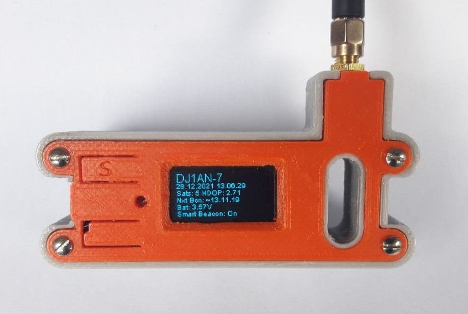

# Cubecell GPS LoRa APRS Tracker

This is a fork of @peterus LoRa APRS ESP32 Tracker ported for the Heltec Cubecell GPS ASR650x CPU

## Supported boards

At this moment, only the Heltec CubeCell GPS is supported:

* Heltec CubeCell GPS-6502 ([HTCC-AB02S](https://heltec.org/project/htcc-ab02s/)) 

This board cost around 25-30 Euros, a little bit cheaper and smaller than the TTGO T-Beam.
Keep in mind: you need a 433MHz version!

## Compiling and configuration

**There is a german [quick start](https://www.lora-aprs.info/docs/LoRa_APRS_iGate/quick-start-guide/) page! Take a look ;)**

**There is a french [quick start](http://www.f5kmy.fr/spip.php?article509) page! Take a look ;)**

### How to compile

The best success is to use PlatformIO (and it is the only platform where I can support you). 

* Go to [PlatformIO](https://platformio.org/) download and install the IDE. 
* If installed open the IDE, go to the left side and klick on 'extensions' then search for 'PatformIO' and install.
* When installed click 'the ant head' on the left and choose import the project on the right.
* Just open the folder and you can compile the Firmware.

### Configuration

* You can find all necessary settings to change for your configuration in **src/config.h**.

## Project State

This Firmware is still in Beta State.
First Goal was the Port to the ASR650x platform, keeping the great Tracking and SmartBeacon Functions from Peters Project.

Please feel free to open an issue if you found Bugs.
