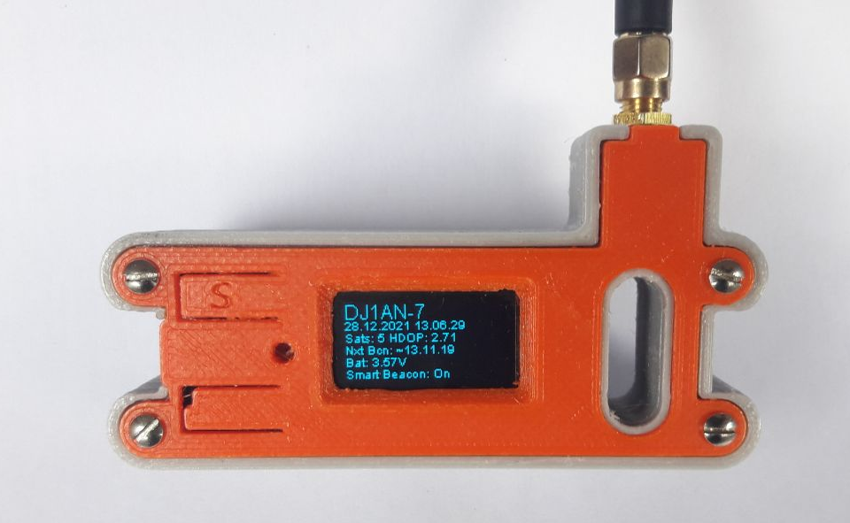

# Cubecell GPS LoRa APRS Tracker

This Project is a fork of [@peterus](https://github.com/peterus) [LoRa APRS ESP32 Tracker](https://github.com/lora-aprs/LoRa_APRS_Tracker) ported to the Heltec Cubecell GPS ASR650x CPU

The code has many parts of the [CubeCell-GPS Helium Mapper](https://github.com/hkicko/CubeCell-GPS-Helium-Mapper)

## Supported boards

At this moment, only the Heltec CubeCell GPS is supported:

* Heltec CubeCell GPS-6502 ([HTCC-AB02S](https://heltec.org/project/htcc-ab02s/)) 

This board cost around 25-30 Euros, a little bit cheaper and smaller than the widely used TTGO T-Beam.

Keep in mind: you need a 433MHz version!

## Project State

First Goal was the Port to the ASR650x platform, keeping the great Tracking and SmartBeacon Functions from Peters Project.

This Firmware is still in a very early and not well-tested State.
Expect Bugs and Functions not working.

Please feel free to open an issue if you found Bugs.

## Compiling and configuration

### How to compile

The best success is to use PlatformIO (and it is the only platform where I can support you). 

* Go to [PlatformIO](https://platformio.org/) download and install the IDE. 
* If installed open the IDE, go to the left side and klick on 'extensions' then search for 'PatformIO' and install.
* Windows users may have to install [GIT](https://git-scm.com/download/win)
* When installed click 'the ant head' on the left and choose import the project on the right.
* Just open the folder and you can compile and upload the Firmware.

### Configuration

* You can find all necessary settings to change for your configuration in **src/config.h**.

### Button Actions

Top Button can be used, the lower Button is hardwired to Device Reset.

* Button < 1s: Open Menu / Next Menu Item
* Button > 1s: Send Position Beacon
* Button > 1s in Menu: Change Setting